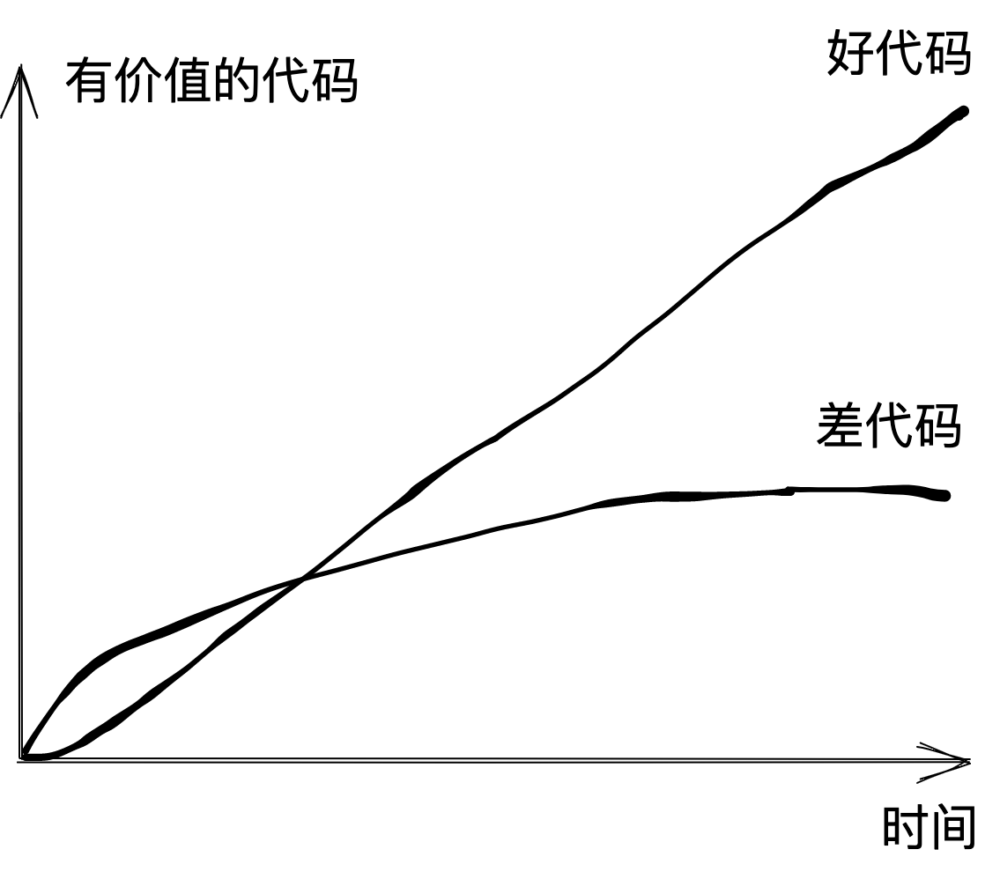

同一个编程语言，同一个业务功能，不同人来实现，写出的代码差别是非常巨大的。有的人写的模块划分合理、代码优雅易懂，像一个精心设计的建筑艺术品；有的人则写的千头万绪、晦涩难懂，像一个拼凑出来的一碰就倒的危房。

可以说不同人用同一个语言写出来的代码，比同一个人用不同语言写出来的差别大的多，一个能写出好的javascript代码的程序员，同样也能写出优雅的go、python等语言的代码，写出好代码的能力是可以迁移的。反之，写不好前端代码的同学，换一个语言照样写的乱七八糟。

**写出好代码的能力是可以迁移的，写出好代码也是有迹可循的**，花些时间去学习如何写好代码，比多看一些知识点，对自己的提升可能更大。

那么如何写出好代码呢？

要想解决问题，首先要先定义清楚问题，搞明白什么是好代码，好代码有哪些特性，继而针对每个特性找出一些行之有效的方法，并在日常编程中去实践体会，最终掌握写出好代码的技艺。

根据笔者多年的工作经验以及深度思考，并结合过往多本经典编程书籍的思想，整理下我对好代码的认识。

## 一、好代码是高价值的

通俗点说就是好代码是有用的，一段没有用处的代码，即使写的再优雅，可能也不会得到同事的认可，领导的赏识，也不能创造社会价值，这样的代码是不能称为好代码的。

价值，是好代码的首要评判标准，这里的价值不只是指业务价值，还包含技术价值，一段代码的价值等于其业务价值和技术价值之和。

> 代码价值 = 业务价值 + 技术价值

所谓业务价值，就是我们写的这块代码解决了用户那些需求（用户价值），为公司带来了什么收益（商业价值）。在写代码之前，我们应该了解每个功能点背后的真实需求，以便我们评估这个功能有价值吗，一定要这么做吗，有没有更好的方式来实现，而不是仅仅把自己当做一个编码工具人。

> 业务价值 = 用户价值 + 商业价值

之前我曾遇到这样一个需求，产品经理要求我们做一套试用申请系统，用户在我们的服务申请页面首先进行登录注册，然后选择想要体验的服务，填写申请表单，申请后会进入申请单进度页面展示申请审核情况，与此同时，后端管理系统收到一条申请单，销售人员需要联系用户核实身份，然后决定通过还是拒绝试用申请，同时还要考虑一些边界情况，比如某个人在服务申请中还能申请吗？一个服务可以申请多次吗？申请通过或拒绝后需要短信通知吗？整个功能需要有很多逻辑需要处理。

我们真的需要这么一套试用申请系统吗？对于用户而言，需要繁琐的注册登录、表单填写，而且申请之后还不知道什么时候会通过，特别是遇到周末或者假期，可能要等很久才有人处理申请单；对于公司来说，销售线索来到之后，没有及时跟进，也没有和客户建立深度联系，很可能错失销售良机。

假如我们将申请试用系统改为展示销售的微信二维码呢？用户可以直接联系销售人员说明自己的需求，销售也可以和潜在客户建立联系，用少量的代码，即可完成更高的业务价值，何乐而不为呢？

相信有多年工作经验的程序员都遇到过这样的事，费了九牛二虎之力做出来的功能没人用，虽然可能主要责任不在程序员，但是我们辛苦编写的代码毫无价值，肯定也会让人心生郁闷，毕竟我们的梦想是要改变世界的~~

在我工作过的团队中，有不少人认为领导们才不管你用什么技术，只要完成了业务目标就是好的，不管三七二十一，先把功能堆上去就行。我不完全认同这种观点，诚然，完成业务目标是很重要的，但是技术也同样重要，只关注短期代码的业务价值而忽略其技术价值是短视的。

一份好的代码，不仅解决了当前业务需求，还可能沉淀了很多可复用的公共组件/库，甚至是基于公司特殊业务需求和规范，开发出一套行之有效的框架，而且好的代码考虑到了如何解耦以及未来的扩展性，更加迅速支持后续的需求变更。

有的人完成了一个项目，就是完成了一个项目，仅仅实现了业务价值；有的人完成了一个项目，沉淀出一套后续可复用的组件、库、工程化工具、最佳实践等。假如两个不同水平的人，来完成一个同样的功能的页面，二者虽然产生的业务价值可能几乎是相同的，但是技术价值差别可能是非常巨大的。

> 技术价值 = 长期效率的提升 - 长期维护的成本

代码的技术价值核心就是长期效率的提升减去长期维护的成本，技术价值是着眼于未来评估的，不是当下。

希望大家在编码时，能够考虑到代码的业务价值和技术价值，多做价值提升的事，多写高价值的好代码。

## 二、好代码是易维护的

产品需求是不断迭代变化的，产品经理今天要这样，明天要那样，作为技术必须要能适应这种变化，这就要求我们的代码要能够方便维护。

代码不只是写给自己看的，更是写给别人和未来的自己看的，相信你也曾经面对过别人写的屎山代码，内心不断地吐槽，改起来战战兢兢如履薄冰，一不小心改了一个bug引起三个bug，或者代码看了一上午，一行也改不动。

当代码不能维护，不能持续创造价值的时候，你肯定不会认可它是好代码。

评价代码的可维护性好不好，最根本的一点就是看随着时间的推移，是否还能持续高效地产出有价值的代码。特别是除了你之外，是否还有人能够贡献代码，如果你写的代码只能你自己维护，那就要考虑是不是哪里有问题了。

### 易维护性的前提是可读性

要维护一段代码，首先你必须能读懂代码，如果读都读不懂，也不存在所谓的维护了，代码是否容易读懂对应着可读性的好坏。提升可读性有很多行之有效的方法，比如有意义的命名、必要的注释、统一的编码风格、适当的空格和换行、使用常量替代具体数字/字符等，后面会重点介绍提升可读性的方法和示例。

### 易维护性的核心是低耦合

从过往编程经验来看，最难改的代码往往是耦合非常严重的代码，比如A区域代码耦合着B区域和C区域的代码，要想修改A，必须还要搞清楚B和C，如果B和C再耦合着D、E、F，很快就达到人脑承受的极限，我们在看代码时，大脑就像是一个代码编译器，面对这样耦合严重的代码，很快内存和CPU就超载了。

耦合严重的代码违反了最小知识原则，要改一块代码需要有大量的认知储备，非常不利于新人进行代码维护；修改耦合严重的代码大概率会引起其他业务代码的bug，就像前面说的，会导致修改一个bug引起三个bug的情况出现；耦合的代码不利于复用，降低开发效率。

### 易维护性的效率取决于复用性

代码可复用性有两个作用，一是在面对新需求开发时，能够利用之前封装好的代码，迅速完成业务功能开发，提升研发效率；二是在面对需求变更时，避免了"散弹式"修改，只需修改一处代码，即可做到各处生效，减少维护成本。

代码复用性做得差，仍然是可维护的，只是维护起来效率很差，通常会遇到一个问题，要在多个文件中修改同样的代码，稍有不慎遗漏一处，就引入了bug，所以提升代码复用性，降低重复代码，有利于提高代码维护效率。

### 易维护性的重要手段是可扩展性

可扩展性是指代码能够方便地添加新的功能和模块，而不影响其他模块的功能和稳定性。简单点说就是要增加一个新功能，不必修改之前的旧代码。常见的插件或者中间件机制，就是可扩展性的一种设计方法，例如webpack中的plugin机制，如何你想扩展webpack的某个功能，不需要修改webpack代码，只需要注入一个插件即可。类似的还有Koa的中间件机制，只需要use一个中间件，就可为koa扩展了一个新功能。

可扩展性做到了基座代码和某个特殊场景代码的可插拔，如果想扩展某个场景，只需要添加少量代码即可实现，而不需要去修改基座代码；想要去除某个场景代码，也只是删除几行代码即可，也不需要修改基座代码，避免了在代码维护过程中，对基座代码的影响，也减少了bug产生的可能性。

综上，为了实现代码可维护性，我们首先要做好代码可读性，然后重点要做到代码低耦合，其次考虑提升代码复用性以减少维护成本提升维护效率，最后可通过可扩展性的设计，减少需求变更对基座代码的影响。

## 三、好代码是高可靠的

高可靠的代码能经得住外部各种不同的环境考验，这里的外部环境可能是不同的操作系统、不同的浏览器或者不同的操作方法等， 不管用户怎么折腾，都能像一个不倒翁一样始终屹立不倒，高可靠的代码让人充满信心。

### 高可靠的代码不能依靠巧合编程

有时候我们可能依靠巧合编程，特别是在面对复杂系统时，在没有搞明白完整逻辑时，恰好修改了某个属性或方法， 或者做了什么不太明确的改动，程序竟然按照我们的期望进行工作了，于是欣喜若狂，在经过简单测试后便匆匆上线， 甚至不敢进行充分的测试， 生怕再出现什么样的问题，这样的代码是脆弱的，就像一盆精心呵护的小花， 一旦拿出去面对外面的风吹雨打，便很快凋谢。

### 高可靠的代码一定是算出来的，而不是凑出来的

假如让两个元素上下间距保持20像素，那么它们的css各个属性分别设置多少， 这个间距等于那几个属性相加，盒模型是什么，有没有考虑BFC的边距塌陷等，最终我们根据布局、盒模型和BFC等知识， 算出来一个数值，经过验证确实上下边距达到了20像素，也可能没有达到，那么分析哪块有问题，而不是通过一个像素一个像素的调整， 最终通过某种巧合，完成了20像素的设置。

### 质量是设计出来的，不是测试出来的

高可靠的代码一定是设计出来的，就像是手表内部复杂的机械结构，每个模块都有什么职责，对外提供什么功能，产生多大的转速， 都是经过严密的设计和计算的，好的设计才是代码高质量的第一关键因素。

每次写完一段代码，应该从头到尾来仔细过一遍，梳理一下每块的逻辑，每个函数调用的意义和结果是否是按照我们设计进行的， 结果正确不一定代表设计正确，巧合的正确结果是不可持续的。

### 高可靠的代码充分考虑了各种异常和边界

就像一个笑话说的，程序员编写了一个点餐系统，自测时用它点了米粉、面条、酒水都没有问题，交给用户后，用户点了一个炸弹，程序崩了。

我们不能指望程序始终在期望的环境下运行，比如用户使用的浏览器可能千差万别，不同品牌、不同版本的浏览器是否能很好的兼容，如果不支持是不是有合理的提示，让用户知道如何去做。再比如有没有考虑用户不同的浏览器分辨率，开发时有没有模拟不同分辨率下的呈现效果。

用户的操作并不总是完全按照我们的预期进行，我们想要用户按照A-B-C-D的顺序操作，用户可能按照D-C-A的顺序去做，如何引导用户按照我们期望去操作，并能在异常操作时给出合理的提醒都是要考虑的。

外部获取的数据或者传递过来的参数并不能总是符合预期，比如我们调用一个后端接口，接口并不能总是返回期望数据，接口状态码可能是404、403、501等等，也可能虽然接口状态码是200，返回的数据是null，也可能接口返回的数据正常，但是你要访问的某个字段不存在，也可能字段存在格式不符合预期，在移动端还可能存在网络连接不上的情况。如果代码只仅仅处理了接口完全符合期望的情况，那么可能一个小问题就导致整个功能无法进行，甚至白屏情况发生。

编码时不能心存侥幸，只针对正常情况编程，更应该考虑好异常和边界，优先引导用户进行正常操作，即使用户进行了非法操作，也能给出清晰明确的提示。

### 高可靠的代码是安全的

在不出安全问题时，总感觉为了安全编程属于鸡肋，是浪费人力无力，而一旦安全问题被人利用，并爆出问题后，才知道安全问题是多么可怕，特别是涉及到用户数据安全的情况，后果往往是程序员要被用来祭天~~

web前端开发中可能经常遇到以下安全问题：

- 网站内容由用户产生，也就是常说的UGC，此时要注意用户输入恶意内容，如文章或者评论中携带非法脚本
- 文件上传避免上传非法的可执行文件
- 文件获取功能避免用户指定超出可访问权限的目录
- 文件上传目录设置为不可执行
- 文件名加随机数或时间戳，让人不能猜到
- 网站短信校验是否有安全限制，避免被人大量盗刷
- 网站登录是否有错误次数，避免暴力破解
- 在服务端执行用户脚本时，特别注意非法脚本以及死循环导致的服务器资源占用
- cookie是否设置了http-only以及secure
- cookie有效期是否过长
- 每个接口是否都增加了权限校验
- 返回敏感信息，手机号，密码等
- 密码传输不加密
- 配置信息、注释等泄露账号密码
- 未使用https
- ...

综上，好的代码应该像个皮实的气球，无论你怎么踢怎么打，都能正确响应，而不应该像个易碎的玻璃球，必须轻拿轻放，小心翼翼的伺候才行。

## 四、好代码是高性能的

高性能可以简单归结为"多快好省"。
- 多：并发支持好
- 快：响应迅速
- 好：质量高、可靠稳定
- 省：节省资源（网络、CPU、内存、硬盘）

对于我们前端来说，高性能主要体现在一个"快"字，首屏加载快、资源加载快、操作响应快、页面流程不卡顿等。

高性能的代码可以节省用户的时间，提升用户的体验和满意度，在两个网站或者APP服务内容一样的情况下，相信大部分用户都会选择性能更好的那个，性能对于产品的发展来说至关重要，通常不是锦上添花，而是至关生死存亡的大事。比如这两年开始流行的Vite，就是因为解决了Webpack编译速度慢的问题而广受欢迎，通过高性能迅速抢占市场。

在前端优化中，通常运用三大类方法：减少请求资源数量、降低请求资源大小、提升代码运行效率。
- 减少请求资源数量：浏览器缓存、路由懒加载、资源懒加载、合并打包、雪碧图等
- 降低请求资源大小：gzip压缩、文件压缩（jss、css）、图片压缩
- 提升代码运行效率：使用缓存、计算属性、合适的数据结构和算法、防抖节流、gpu加速等

## 总结

我认为的好代码具有四大特性：高价值、易维护、高可靠和高性能。其中高价值是前提，我们尽量编写高价值的代码，这就要求我们具备一定的产品思维；易维护是核心，必须时刻注意代码的可维护性，通过提升可读性、降低耦合、提升复用性和增强扩展性来让代码易维护；除了这两个重点特性外，我们还要注重代码的高可靠性和高性能。

后续会重点阐述如何提升代码的易维护性以及如何提升产品思维，也会讲解下提升高可靠性和高性能的行之有效的方法。