如果你发现你的代码改了一个地方却莫名影响到了其他地方，就说明你的代码存在严重的耦合了，需要考虑下如何解耦了，耦合是影响代码可维护性最核心的因素，平时编码时要注意通过一些方法降低模块之间的耦合，耦合只能降低，并不能消除，所以我们平时会听到"高内聚，低耦合"的说法，而不是无耦合。

和耦合对应的就是正交，本节我们来总结下什么是耦合/正交、耦合常见的表现形式以及解耦的方法。
# 耦合
## 1. 什么是耦合
在百度百科中，对耦合的解释
> 耦合是指两个或两个以上的体系或两种运动形式间通过相互作用而彼此影响以至联合起来的现象。

我曾经买过一个遥控飞机玩具，当我推前进杆的时候，飞机除了前进，还会往左或者往右移动；而我推左右杆的时候，除了左右运动， 还会伴随着前进和升高；而我按上升键的时候，除了上升还会伴随着不规则的前进或者左右转弯；

飞机的运行姿态完全不受我的控制，理想状态下，前进就是前进，不要有左右摇摆和升降，左右操作和升降操作也理应如此， 这样的系统才是好操作的，否则，每一个操作都会影响其他操作，根本无法顺利完成一个简单的任务。

代码中的耦合也是如此，明明我只想修改A功能，却无意中影响了B功能，而去修复B功能时又连带影响了C功能， 像这种当修改一块代码会影响另一块代码时，则称这两块代码是耦合的。

但是耦合这个概念有点歧义，比如A模块和B模块耦合，我们不知道到底是A模块调用B模块还是B模块调用A模块， 所以更准确的描述模块之间的关系可以用"依赖"，A依赖B意味着A需要调用B的暴露的API。

耦合并不是完全不好，一个模块要想被别人使用，那么就必然存在耦合，所以一般讨论的都是怎么样低耦合，我们应该尽量消除一些不合理的耦合，也就是消除不合理的依赖关系，从而让系统更易维护。

## 2. 常见的耦合类型

### 2.1 系统级别耦合

**技术选型的耦合**

相信大家都听过单体模式和微服务模式，在单体模式中，多个项目之间必须使用相同的开发语言，相同的第三方模块版本等等，比如原来项目用Vue2+ElementUI2开发，现在新出了Vue3和Element Plus，对不起，除非你把整个项目都进行升级，否则你是不能使用这些新技术的，因为在架构层面，
单体模式就要求了新开的项目必须依赖原有项目采用的技术，这就是一种架构上的耦合。而采用微服务架构则不存在这个问题，每个项目都是独立的， 各个子项目之间不存在依赖，你可以使用Vue2，也可以使用Vue3，甚至也可以选用React。

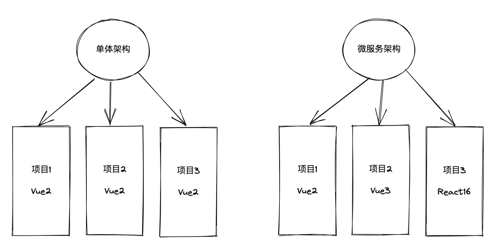

对于后端服务也是一样的，通过使用微服务架构，各个模块之间通过http进行调用，而不再直接基于某种语言进行方法的调用，实现了各服务之间在技术选型上的解耦。

**部署环境的耦合**

现在越来越多的企业选用基于Docker的部署方式，使用Docker技术，为每个服务创建单独的容器，每个容器包含自己所需的部署环境，在没有使用Docker时， 如果想在一台服务器上同时部署PHP、Java、Python等多种语言应用，甚至是同时部署同一语言但是不同版本的应用，是非常困难的，经常会遇到冲突的问题， 而采用Docker就解除了这种耦合关系，这也是Docker为什么这么流行的原因之一。


### 2.2 系统和第三方模块的耦合

在前端项目中基本都会用到网络请求的第三方库，比如axios、fetch等，如果我们直接在页面中直接调用axios的方法进行网络请求，那么假如有一天我们要更换网络请求库，或者升级网络请求库的版本，假如新的请求库方法、传参顺序和之前不一致，就会带来大量的修改工作，我们的系统和第三方库严重耦合在了一起。

再深入思考一下，我们其实需要的是网络请求，而不是axios，我们要怎么进行网络请求，不应该依赖于axios提供怎样的接口，而是我们定义网络请求的接口，然后利用axios去实现它。

比如我们可以定义一个网络请求模块request，request内部调用axios的方法，项目中调用request提供的方法，如果有一天想要更换axios，只需要修改request中的方法即可。

改造前的页面中的网络请求
```javascript
//页面中直接调用axios
import axios from 'axios'
function getData(url, params){
    axios.get(url, params)
}
```

改造后的request.js（简单示意）
```javascript
import axios from 'axios'
function request(url, options){
    return axios(url, options).then(res =>{
        
    }).catch(e =>{
        
    })
}

function get(url, params){
    return request(url, {
        method: 'GET',
        params
    })
}

function post(url, body){
    return request(url, {
        method: 'POST',
        body
    })
}
export default {
    get,
    post
}
```

改造后的页面中的网络请求
```javascript
import request from '@/utils/request'
function getData(url, params){
    request.get(url, params)
}
```

通过这样的改造，即使以后axios的接口传参方式发生了变更，或者我们直接更换axios为fetch，也都非常容易进行，因为我们通过这种依赖倒置的方式，完成了项目和第三方组件的解耦。

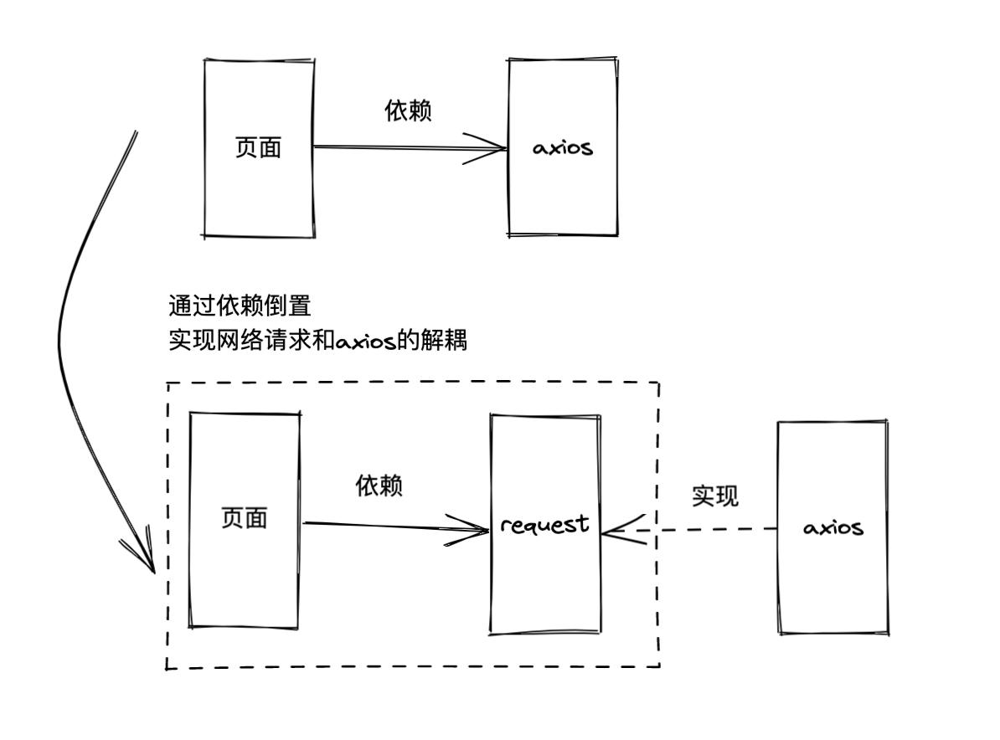


后端也存在类似的问题，比如后端进行日志保存时，如果直接依赖Log4j这样的日志框架，则后续要更换日志框架就会带来大量的修改， 同样的，我们可以封装一个日志类，然后用第三方的Log4j去实现它，完成项目和具体日志框架的解耦。


### 2.3 循环依赖

未经良好设计的系统，经常会发现存在循环依赖问题，比如utils中的三个模块A、B、C，A调用B中的某个方法，然后B又调用A中的方法，或者A调用B，B调用C，C再调用A，也形成了循环依赖。

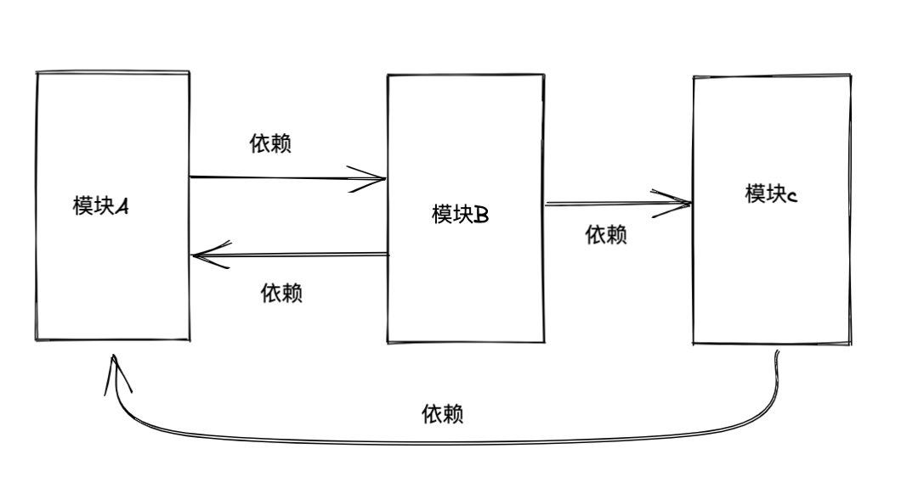

循环依赖的系统，造成模块之间充分的耦合，非常不方便进行修改，可以通过分层的方式，解除这种依赖，比如我们将utils中的方法分为基础层utils和业务层utils，业务层的utils可以依赖基础层utils，但是基础层不能依赖业务层，从而解除循环依赖。

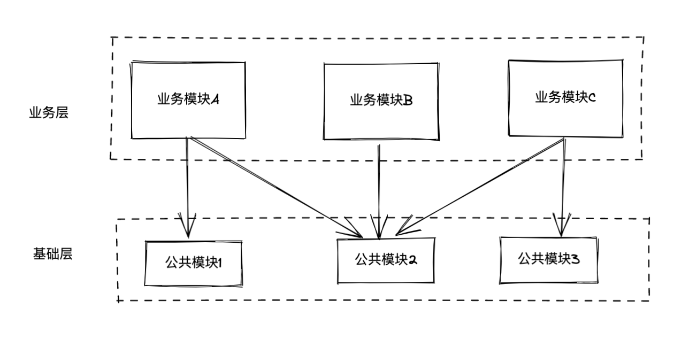

### 2.4 全局数据耦合

如今在前端项目中，全局变量使用相对较少，但是全局数据越来越多了，由于vuex和redux的使用，越来越多的模块通过全局状态来链接多个功能模块， 诚然，有时候我们需要利用这种耦合，但是要尽量控制涉及这种耦合的模块数量。

耦合全局数据，势必会破坏模块或者组件的封装性，导致组件难以被复用；同时耦合全局数据，也破坏了可测试性，导致我们写单测的时候，要模拟的全局数据代码，比我们测试本身的代码还要长。

比如我们有个diff函数，对比两个对象的差别，如下，传递的参数为target，要对比的源数据取自全局状态。
```javascript
//utils中的diff函数
function diff(target){
    let source = store.state.appInfo
    //对比source和target
}
```

如果这样实现，那么会有以下几个问题：
- 阅读业务中的代码时，不知道diff是和谁对比，必须深入进diff函数才能了解真相，无疑增加了阅读的认知负担

```javascript
//业务中的代码
import {diff} from 'utils'

function getDiffResult(info){
    return diff(info);  //当阅读这块代码时，你知道是和谁对比吗？
}
```

- diff方法无法迁移到别的项目，或者不能被别的模块使用，因为别处使用时不一定是要和这个全局变量进行diff，降低了可复用性
- diff方法测试时，必须要mock全局变量，降低了可测试性

我们只需进行进行简单的改造就能解除这种耦合，那就是把全局变量作为参数进行传递，这样起码保证了diff函数的可复用和可测试。

```javascript
//utils中的diff函数
function diff(source, target){
    //对比source和target
    //不在依赖任何全局变量，可以随处使用
}
```

```javascript
//业务中的代码
import {diff} from 'utils'

function getDiffResult(info){
    return diff(store.state.appInfo, info);  //清晰的看出谁和谁进行比较
}
```

全局数据除了带来耦合，破坏了封装性、可复用性和可测试性，全局数据还会带来可读性的降低，我们不知道某个全局数据从何而来，何时改变，除非你对它有详细的了解，而这就违背了最小知识原则，要改一行代码，要先补充大量的认知，这无疑是可怕的。

如无必要，勿增全局变量。


### 2.5 数据结构的耦合

当一个函数的参数为对象时，也就意味着函数必须了解该对象的结构，这也是一种耦合。

一旦对象的数据结构发生变化，函数内部的实现也必须跟着变化，虽然有时这种变化不可避免，但应该避免深入了解对象内部的结构，也就是避免获取对象的孙子级别数据。

假设有个删除产品的处理函数，我们需要拿到产品id然后调用接口，如果传递的参数为this.formData，需要通过this.formData.product.id才能拿到产品id，代码如下：

```javascript
function deleteApp(formData) {
  //必须清楚传递过来的formData格式
  let id = formData.product.id;
  
}

deleteApp(this.formData)
```

可以看出，删除函数deleteApp耦合了formData这个对象，一旦对象结构发生变化，删除函数也必须跟着修改，我们肯定期望数据结构变化不影响其他函数的内部实现。

修改也很简单，只需要调用deleteApp时，直接以id为参数传递过去即可，简单的修改就让表单数据结构和处理函数解耦。

```javascript
function deleteApp(id) {
    //不再受formData结构影响
}

deleteApp(this.formData.product.id)
```

###  2.6 函数和API接口耦合

一般我们的函数和API接口都会有一些耦合，毕竟要从接口取数据，导致接口的变更都会引起前端的变化， 比如后端把创建时间这个字段由createTime改为created，前端就要跟着变化，目前没有好的解决方案，如果采用字段映射， 代价太大，只能针对一部分字段进行解耦处理。

示例1：
比如后端定义状态：
- 0: 已同步
- 1: 未同步
- 2：冲突

如果我们在代码中直接使用，首先可读性不好，其次如果后续后端修改了状态和数值对应关系，前端也要跟着修改，造成耦合。

```javascript
function deleteHandle(rowData) {
    if (rowData.status === 0 || rowData.status === 2) {

    }
}
```

通过定义状态常量，来解耦后端接口状态和具体数值的对应关系。

```javascript
export const K8S_RESOURCE_STATUS = {
    synchronized: 0,
    unSynchronized: 1,
    inconsistent: 2
};

function deleteHandle(rowData) {
    if (rowData.status === K8S_RESOURCE_STATUS.synchronized
        || rowData.status === K8S_RESOURCE_STATUS.inconsistent) {

    }
}
```

和API耦合的场景还包括后端接口地址变更带来的变化，所以前面我们介绍了，针对网络请求，需要将API地址做成配置文件，以及将网络请求封装到service层，降低前端对API接口的耦合。

### 2.7 组件/模块之间的耦合

前端同学基本都知道子组件之间进行通信，是不能直接互相调用的，那样就造成了子组件之间的耦合，某个子组件发生了什么事情，只需要把事件抛出就行了，具体怎么进行后续处理，是领导层（父组件）要来考虑和设计的，将来有什么变化，也是父组件来决定的， 子组件无权过问，更不能指手画脚去操控别的组件。

业务的流程控制权，应该交给父组件，子组件只负责完成自己职责范围内的事，不要越权。

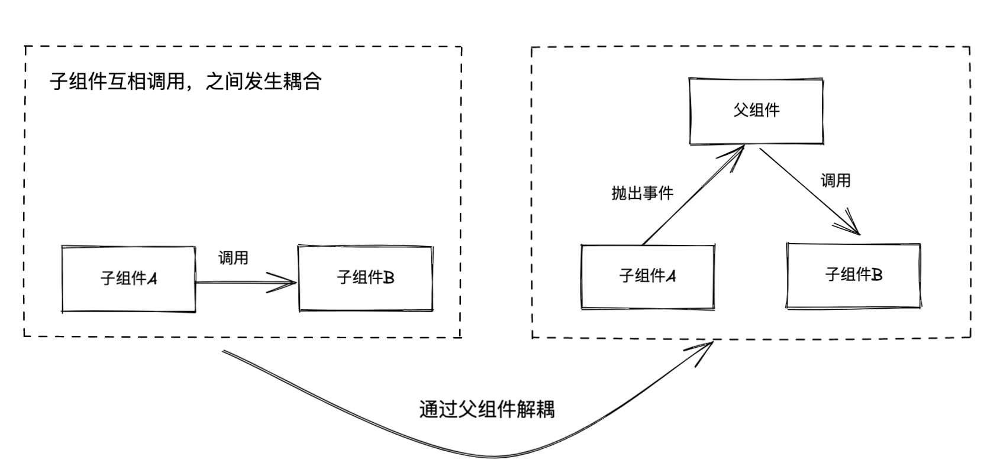

与之类似的还有子孙组件的通信，比如通过事件总线EventBus，发生了某个事件就抛出，谁关心这个事件，谁就监听，抛出事件方和接收事件方解耦。

还有像通过消息队列、观察者模式、订阅模式等都是类似的思路，数据或者事件的生产方不关心后续怎么处理，通过注册和监听这种模式，实现生产方和消费方的解耦。

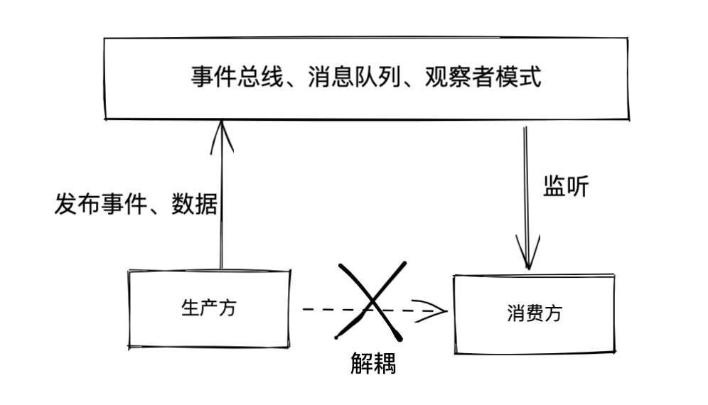


# 正交和解耦

## 1. 正交系统
在几何中两条直线相交后呈直角，就说它们是正交的，对于向量而言，这两条线相互独立，向着完全不同的方向发展。

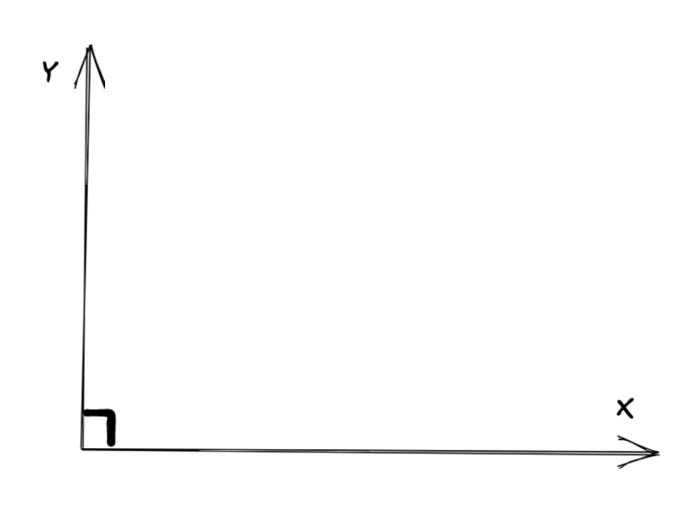

在计算机中，正交象征着独立性或解耦性，对于两个或多个事物，其中一个改变不影响其他任何一个，则称这些事物是正交的。比如数据库相关的代码应该和用户界面保持正交，改变界面不影响数据库，切换数据库也不会影响界面。

我们希望设计的组件自成一体：独立自主，有单一的清晰定义的意图。当组件彼此隔离时，你知道可以变更其中一个组件，而不必担心影响到其他组件。 只要不改变组件的对外接口，就可以放心，不会影响系统中其他部分。

## 2. 正交系统的优点

正交系统能带来两个主要收益：提高生产力和降低风险，同时也能提高系统的可测试性

###  提高生产力
- 将变更限制在局部后，开发时间和测试时间都会减少。编写相对较小的、独立自主的组件比编写完整一大块代码要容易。
- 正交的方法同时促进了复用，如果组件职责定义清晰单一，就越能和其他组件进行各种组合
- 如果一个组件能做M件独特的事情，另一个能做N件，如果他们是正交的，组合起来可以做M*N件事，如果两个组件不正交，就很难组合

### 减少风险
- 代码中的病变部分被隔离开，如果一个模块出现问题，不太可能将症状传播到系统其他部分，把生病的部分切除换成新的也很容易实现
- 系统不会那么脆弱，对特定区域进行小的变更和修改后，因此产生的问题也都局限在该区域
- 正交的系统更有利于测试，可测试性更强
- 不会被特定的第三方组件束缚，可根据情况随时替换其中某一部分

### 提高可测试性
- 如果你发现一块代码，不好进行单元测试，那么说明它大概率耦合性太强
- 为了测试耦合的代码，需要进行大量前置准备，准备代码比要测试的代码本身可能还要长
- 正交的系统非常方便构造测试用例，可测试性和正交性正相关

## 3. 解耦的几种方法

### 3.1 黑盒开发
多个模块进行调用时，通过模块对外提供的API进行调用，而不需要知道其内部的实现细节，每个模块彼此就像是一个黑盒一样。

所谓的黑盒就是不需要知道内部的实现细节，比如不用知道模块内部的数据结构、调用顺序等。


比如某个组件类Component内部有个事件类Event，Event提供了事件代理的delegate方法。
```javascript
let component = new Component();
component.event.delegate('click', callback);
```
该示例中，要想进行事件委托，需要通过组件内部的event实例进行调用，也就是要知道组件类内部的结构，即组件类有个名为event的属性，event属性下有个delegate方法， 如果组件类内部后续想给内部属性event改名，那么所有调用事件代理的业务代码中，都必须进行修改，也就是业务模块和组件类的实现存在深度耦合。

较好的实现是组件类对外直接提供事件代理方法，然后内部的delegate方法再调用Event类的delegate方法。

```javascript
class Component {
    delegate(eventName, callback){
        this.event.delegate(eventName, callback)
    }
}

let component = new Component()
component.delegate('click', callback)
```
后续组件类调整代理方法delegate，只要不改变API结构，业务不受影响，对业务来说就像一个黑盒一样。

在我们前端中，组件就是一个黑盒，组件对外暴露props、method和事件，外部只能通过组件对外提供的这些接口来进行交互，而不应该去操纵组件内部的data/state数据，比如有个Button组件，我们可以根据它对外暴露的属性type来修改其展示样式，而不能直接去修改它的内部数据。

```vue
<template>
    <ElButton ref="button">按钮</ElButton>
</template>
<script>
export default {
    mounted(){
        //错误用法，不应该直接其内部data
        this.$refs['button'].color = 'red';
    }
}
</script>
```
假设Button组件以后进行了升级，它也只会兼容对外暴露的接口，比如保持props不变，但是不能保证内部data中还有一个叫color的属性，修改的人也不会想到有人使用了它的内部data，所以这种依赖会造成风险，也就是我们使用组件时不应该耦合组件内部的实现。

### 3.2 分层
解耦的本质就是关注点分离，而分层是关注点分离的一种常见且重要方法。

前端的发展史，就是一个分层发展的历史，最初前后端混合开发，UI页面代码和数据库相关代码混合在一起，后来开始采用MVC分层模式进行开发，实现了前后端分离，通过这种方式解耦后，前后端开发终于可以顺畅的并行开发，也让前端的地位越来越重要，近年来随着Vue、React等MVVM模式框架的出现，前端也进入了历史最好的时代。

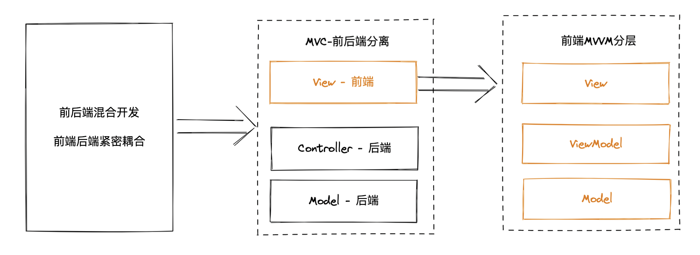

以MVC为例，分层之后，View层和Model层实现了解耦，Model层负责数据库查询和修改，Model修改实现不影响View层，而View层变化也不会影响Model层代码，通过这种分层方式带来了以下2个好处：
- 并行开发：前后端工程师可以并行开发各自代码，只要约定好交互的数据结构即可
- 提高复用：一个包含着前后端逻辑的页面很难在另一个项目中使用，几乎没有前后端完全一致的页面，但是分层之后，即使View层不完全一样，Model层和Controller层大概率还是可以复用的。

在前端开发的各个维度，其实都可以利用分层的思想进行开发，比如CSS开发我们可以包含主题变量、全局css、页面css、组件css几个层次；utils库也可以分为基础通用utils和业务utils，基础的utils就是和业务无关的utils，比如经常会看到的生成唯一字符串uuid函数；组件也可分为基础组件和业务组件，基础组件和具体业务解耦，比如通用的表格组件、弹窗组件等。

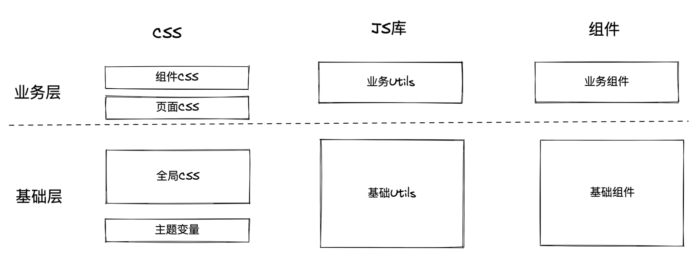

基础层的CSS、JS和组件由于和业务解耦，其复用性大大提升，基本上新开项目之后，原来的基础层代码都是可以直接拿来用的，如果你每次新开项目都是从头做起，说明没有做到和业务解耦。

我们的目标是通过解耦，将基础层做大做厚，而且基础层属于稳态代码，业务层属于敏态代码，基础层做好了之后，几乎不需要太多改动。

### 3.3 依赖倒置
依赖倒置原则（Dependency Inversion Principle，DIP）是一种设计原则，它强调高层模块不应该依赖于低层模块，而是应该依赖于抽象接口。具体来说，依赖倒置原则要求高层模块应该依赖于抽象接口，而不是具体的实现细节。

换句话说，依赖倒置原则要求我们应该将高层模块与低层模块解耦，从而提高代码的可维护性和可扩展性。高层模块应该依赖于抽象接口，而不是具体的实现细节，这样，如果需要改变低层模块的实现细节，只需要修改低层模块的接口即可，而不需要修改高层模块。

比如公司为福特和本田两家公司开发了一套自动驾驶系统，只要安装到两家汽车上就能实现自动驾驶功能。

我们定义了一个自动驾驶系统类AutoSystem，一个福特汽车类FordCar，一个本田汽车类HondaCar。

假设福特汽车和本田的启动方法不一样，一个是run、一个是driver，在自动驾驶系统里面要启动汽车就要区分二者。

```javascript
class HondaCar{
    run(){
        console.log("本田开始启动了");
    }
}
class FordCar{
    driver(){
        console.log("福特开始启动了");
    }
}

class AutoSystem {
    run(car){
        if(car instanceof HondaCar){
            car.run()
        }else if(car instanceof FordCar){
            car.driver()
        }
    }
}
```
现在公司业务壮大了，即将为宝马汽车安装自动驾驶系统，宝马汽车的启动汽车方法为startCar，那么自动驾驶系统又要进行修改，以支持宝马汽车。
```javascript
class HondaCar{
    run(){
        console.log("本田开始启动了");
    }
}
class FordCar{
    driver(){
        console.log("福特开始启动了");
    }
}
class BmwCar {
    startCar(){
        console.log("宝马开始启动了");
    }
}

class AutoSystem {
    run(car){
        if(car instanceof HondaCar){
            car.run()
        }else if(car instanceof FordCar){
            car.driver()
        }else if(car instanceof BmwCar){
            car.startCar()
        }
    }
}
```
随着后续业务的壮大，自动驾驶系统里面会充斥着各种if-else，这还是只存在启动汽车一个方法的示例，实际情况肯定更复杂，每次谈下合作方，自动驾驶系统都要做大量的适配，显然这是很不合理的，自动驾驶系统和具体车型存在严重耦合。这正是因为高层应用依赖了底层实现，假设我们要求所有的汽车都应该有固定的方法，也就是后端常说的接口interface，那么自动驾驶系统就不再需要频繁改动，每次增加新的车型，只要增加相应的汽车类接口。
```javascript
class HondaCar{
    run(){
        console.log("本田开始启动了");
    }
}
class FordCar{
    run(){
        console.log("福特开始启动了");
    }
}
class BmwCar {
    run(){
        console.log("宝马开始启动了");
    }
}

class AutoSystem {
    run(car){
        car.run()
    }
}
```
可以看到自动驾驶类AutoSystem大大简化了，而且后续也不再耦合具体车型了。

总接下来就是：

1.上层应用不应该依赖于下层模块，他们都应该依赖于抽象。

2.抽象不应该依赖于具体，具体应该依赖于抽象。

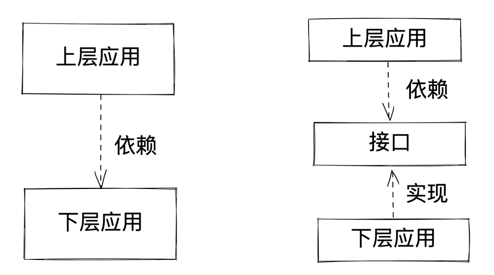

### 3.4 中间层映射、适配层
A依赖B，如果要把A和B解耦，我们可以在A、B之间加一层中间层C，将依赖关系变成了A依赖C，C依赖B，这样避免了A和B的直接耦合。

如果后续B发生变更，只需要修改适配层C即可，A层代码不需要动。

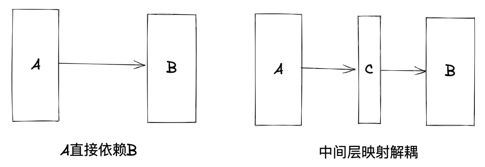

可能有人会说，增加了一层，那么B变化，不还是要修改吗，只是把A处的修改挪到了C处。

假如A调用B某个方法5次，如果B修改了该方法的传参顺序，那么A要跟着修改5次；如果采用中间层映射，B修改之后，只需要修改中间层C一处，A不需要任何修改，
可以看出通过增加中间层或者适配层，减少了依赖部分变化后整个系统的修改次数。

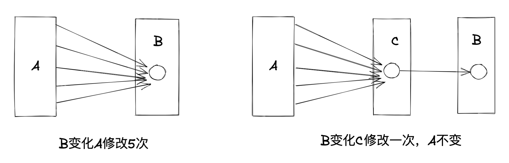

添加中间层让我们对某个第三方模块的依赖不再那么深，也更加容易替换，不把系统和固定的供应商进行绑定。

### 3.5 生产消费、发布订阅、事件、消息队列

以我们熟知的事件为例，生产方抛出一个事件到事件总线，消费方监听某个事件而做出动作，
事件生产方不去关心这个事件到底谁去处理，事件消费方也不关心事件是谁产生，通过这种方式实现了生产方和消费方的解耦。
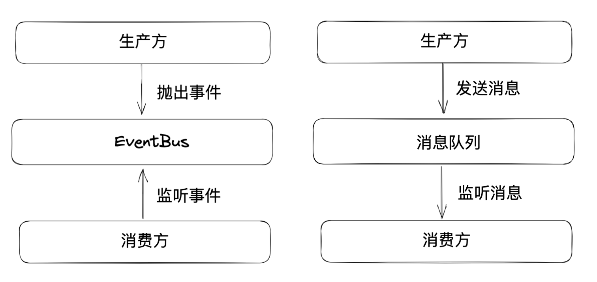

比如一个生产方product，如果不采用事件方式，大致操作如下，在生产方代码中调用消费方
```javascript
function product(){
    custom1()
    custom2()
}

function custom1(){
    
}
function custom2(){

}
```

如果随着需求的变化需要增加一个消费方custom3，去掉消费方custom1，那么product就要做出相应修改，也就是生产方代码和消费方代码耦合。
```javascript
function product(){
    //去除custom1()
    custom2()
    //新增
    custom3()
}
```

而采用事件总线，则没有这个问题，生产方抛出事件和相关数据即可，无论怎么处理，生产方代码不变。

```javascript
function product(){
    event.emit('someEvent', data)
}
```

与之类似的还有消息队列、观察者模式、生产消费模式等，虽然也有区别，但大体思想都是实现生成和消费方的解耦。


### 3.6 纯函数

纯函数是所有函数式编程语言中使用的概念，纯函数就像我们数学中的函数 y = f(x)，y的值只取决于参数x，也就是只要参数x确定，输出值y就一定不变。代码中的纯函数一般都具有如下几个特点：

- 函数返回值只取决于参数，如果参数不变，返回值就不变
- 函数执行过程中没有副作用

示例1：非纯函数每次调用结果可能不同
```javascript
//非纯函数，每次调用add返回值不同
let count = 0
function add(){
    return count++
}

//纯函数
function add(a, b){
    return a + b
}
```

示例2：非纯函数可能依赖外部变量，如全局变量
```javascript
//非纯函数, 会依赖全局变量
function add(a){
    return window.count + a
}
```

所谓副作用，就是函数执行对外部有影响，这种影响包括但不限于：

- 修改参数值
- 调用网络请求
- 操纵dom
- 进行存储

```javascript
//非纯函数, 副作用：改变参数结构
function format(data){
    data.value = data.value + ''
    return data
}

//非纯函数, 副作用：网络请求
function getData(data){
    return axios.get(url)
}

//非纯函数, 副作用：存储
function setData(data){
   localStorage.setItem('a', data)
}
```

由于纯函数的这些特点，决定了纯函数天然的就比普通函数的耦合性要低，比如它不依赖外部全局数据、它对外不产生副作用， 当然就不会和外部进行紧密的耦合。

所以我们应该在开发时，尽可能的多用纯函数，非纯函数当然无可避免，但是我们要做的，是在一些有副作用的业务代码中， 抽取出来纯函数，一个有副作用的大段代码，很多时候都可以拆成一个有副作用的小函数 加一些小的纯函数，我们把耦合部分限制在极小的代码区域中。

比如一个utils函数diff，参数为target，会将target与某个全局变量进行比对，这显然就不是一个纯函数，也存在和全局变量的耦合，我们只需简单改造即可成为纯函数。

```javascript
//非纯函数
function diff(target){
    let source = window.source
    //比对
}
```

改造后

```javascript
//utils中的纯函数
function diff(source, target){
    //比对
}


//业务中调用
diff(window.source, target)
```
经过简单改造，代码的耦合部分仅局限在业务代码中，而基础的utils函数就消除了这种耦合问题。

推荐在代码中，尽量多写纯函数。


### 3.7 策略模式
我们经常会遇到把一些接口中的某个属性值转换为中文，展示在页面中的情况，比如用户类型，接口中一般是英文 ，展示在页面肯定都要转为中文。
```javascript
function getLabel(type){
    if(type === 'normal'){
        return '普通类型'
    }else if(type === 'vip'){
        return '会员'
    }else {
        return '未知'
    }
}
```
如果业务发生了变化，又新增了一种会员类型，那么就需要到处修改转换这块的代码，也就是业务规则和我们的UI展示存在强耦合。

针对这个解决办法也很简单，将业务逻辑提取到配置文件中，作为一种策略来使用，后续业务变化只更新策略即可。

```javascript
//配置文件config.js
export const userType = {
    normal: '普通类型',
    vip: '会员',
    svip: '超级会员',
    default: '未知'
}

//业务中使用
function getLabel(type){
    return userType[type] || userType['default']
}
```
可以看出业务代码没有了讨厌的if-else，而且业务的变化后，也不需要修改代码，只要更改策略配置即可，这样也符合开闭原则。

当然这只是最简单的一种策略模式使用方式，不过道理都是相通的，一些复杂的逻辑处理也是可以的，比如现在有这样一个页面，一个tab页，展示各国的疫情数据，比如展示中国的、世界的、当前所在城市的，当切换tab页的时候需要分别请求不同的数据，中国的、世界的和当前所在城市UI也不一样。

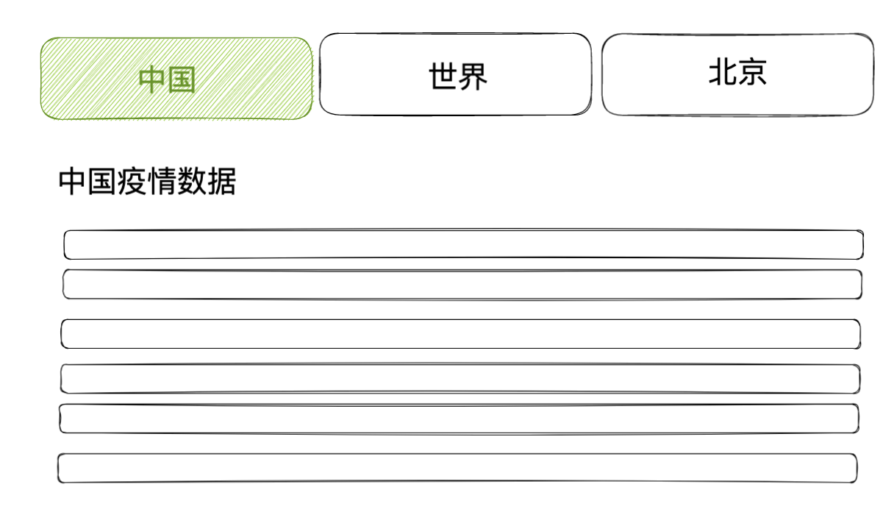

```vue
<template>
  <div>
    <tabs v-model="activeTab" @change="tabChange">
      <tab-pannel name="china"><ChinaData /></tab-pannel>
      <tab-pannel name="world"><WorldData /></tab-pannel>
      <tab-pannel name="beijing"><BeijingData /></tab-pannel>
    </tabs>
  </div>
</template>
<script>
export default {
  data() {
    return {
      activeTab: 'china'
    }
  },
  methods: {
    tabChange(tab) {
      if (tab === 'china') {
        //请求中国数据
      } else if(tab === 'world') {
        //世界数据
      }else if(tab === 'beijing'){
        //北京数据
      }
    }
  }
}
</script>
```
如果现在产品经理要加一个美国的数据进行对比，势必要修改很多逻辑，我们可以通过策略模式来解除这种耦合。

增加一个config，有两个字段：
- getData：不同城市对应的获取数据函数
- component：不同城市对应的UI展示组件

```vue
<template>
  <div>
    <tabs v-model="activeTab" @change="tabChange">
      <tab-pannel v-for="(item, type) in config" :key="type">
        <component :is="item.component" />
      </tab-pannel>
    </tabs>
  </div>
</template>
<script>
export default {
  data() {
    return {
      activeTab: 'china',
      //增加策略配置config
      config:{
        china: {
          getData: this.getChinaData,
          component: ChinaData
        },
        world:{
          getData: this.getWorldData,
          component: WorldData
        },
        beijing:{
          getData: this.getBeijingData,
          component: BeijingData
        },
      }
    }
  },
  methods: {
    tabChange(tab) {
      //切换页签的逻辑变的异常简单
     this.config[tab].getData()
    },
    getChinaData(){
      
    },
    getWorldData(){
      
    },
    getBeijingData(){

    }
  }
}
</script>
```
改造之后如果要增加美国数据，只需要在config中进行配置即可，其他逻辑不需要任何修改，其他逻辑不用修改也就说明不存在耦合。

### 3.8 责任链

还有一种耦合关系是模块之间的调用顺序的耦合，比如函数A调用函数B，函数B调用C，
如果有一天调用顺序变了，那么相关的处理代码就要做相应的调整。

以表单校验为例，假设我们针对名称校验有三个校验方法，分别为校验是否为空、长度是否合法、是否包含特殊字符，
```javascript
function checkEmpty(){
    //校验逻辑
    checkLength()
}
function checkLength(){
    //校验逻辑
    checkSpecialCharacter()
}
function checkSpecialCharacter(){
    //校验逻辑
}
```
如果现在新增一个校验逻辑，比如不能以字母开头，要放在第2个校验位置上，那么就要修改其他校验逻辑的代码。

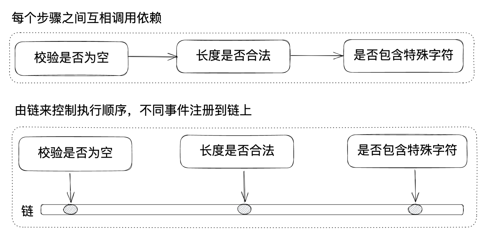

针对这种情况，我们可以使用责任链模式来进行改写，所谓责任链简单来说，就是每一步执行之后要做什么事，不再是写死的了，而是动态配置的，每个处理函数注册到链上，由责任链负责控制整个的执行顺序。

实现方式有多种，比如后端可能用到的基于继承来实现，每个责任链的处理函数有个next属性，指向下一个。
```javascript
class CheckChainHandler{
    constructor() {
        this.nextHandler = null;
    }

    setNextHandler(nextHandler) {
        this.nextHandler = nextHandler;
    }
    doValidate(params){
        throw new Error('必须由子类重写的验证方法');
    }
    executeValidateChain(params){
        let validateResult = this.doValidate(params);
        if(!validateResult) return;
        if (this.nextHandler){
            this.nextHandler.executeValidateChain.call(this.nextHandler,params);
        }
    }
}
class EmptyCheckHandler extends CheckChainHandler {
}
class LengthCheckHandler extends CheckChainHandler {
}
class SpecialCharacterCheckHandler extends CheckChainHandler {
}

function checkName(name){
    const emptyCheckHandler = new EmptyCheckHandler()
    const lengthCheckHandler = new LengthCheckHandler()
    const specialCharacterCheckHandler = new SpecialCharacterCheckHandler()
    emptyCheckHandler.setNextHandler(lengthCheckHandler)
    lengthCheckHandler.setNextHandler(specialCharacterCheckHandler)
    
    emptyCheckHandler.executeValidateChain(name)
}
```

前端中我们一般常见的是采用use的方式来进行责任链的创建，相对来说使用更加简单。
```javascript
const checkMiddleware = new CheckMiddleware()
checkMiddleware.use(checkEmpty).use(checkLength).use(checkSpecialCharacter)
```

gulp中的管道：
```javascript
gulp.src('client/templates/*.jade')
  .pipe(jade())
  .pipe(minify())
  .pipe(gulp.dest('build/minified_templates'));
```

koa中的中间件：

```javascript
const Koa = require('koa');
const app = new Koa();
// logger
app.use(async (ctx, next) => {
  await next();
  const rt = ctx.response.get('X-Response-Time');
  console.log(`${ctx.method} ${ctx.url} - ${rt}`);
});
// response
app.use(async ctx => {
    ctx.body = 'Hello World';
});
app.listen(3000);
```

### 3.9 慎用全局数据

全局数据天然的将多个不同的模块耦合在一起，上面也有相关内容，不再赘述，对于全局数据，尽量少用，持谨慎态度，有时可通过传参方式，避免大量的模块与全局数据耦合，减少耦合的模块数量。


# 本章小结
- 耦合就是多个模块之间互相依赖影响，耦合不能消除，只能降低
- 造成耦合的情况有多种，有系统级别的耦合，系统和第三方模块的耦合，循环依赖，全局数据带来的耦合，数据结构的耦合，前端和后端API之间的耦合，模块之间的耦合等
- 构建正交的系统可以提高生产力，降低风险，一个模块的可测试性与正交性正相关，可以用是否可测试来判断耦合程度
- 解耦有多种方式，包括黑盒开发、分层、依赖倒置、增加适配层，使用生产消费、发布订阅、观察者、事件、消息队列、策略、责任链等模式，使用纯函数，慎用全局变量