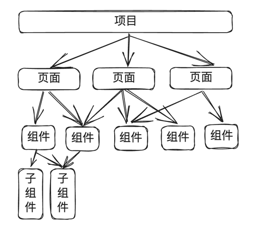
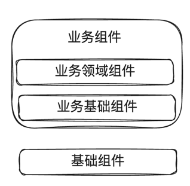
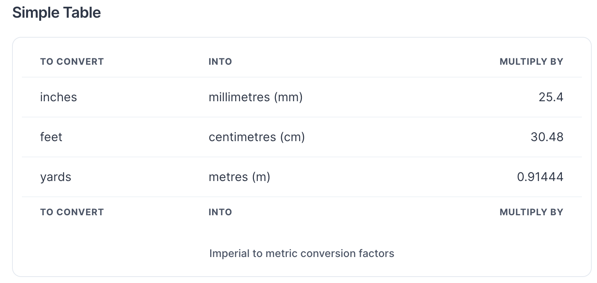
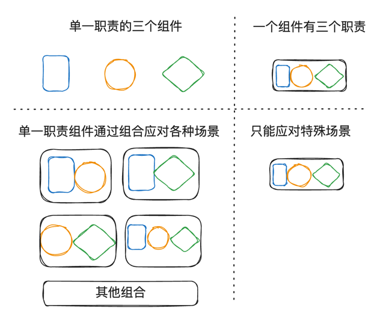
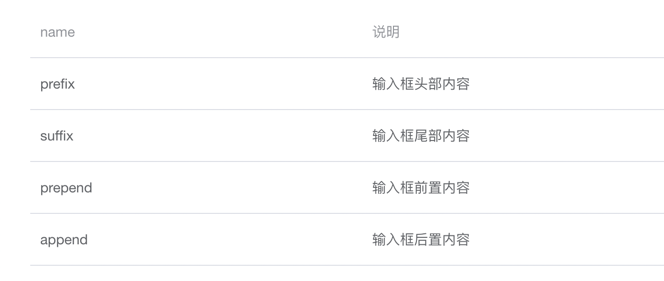
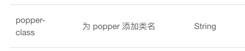

组件（Component）是指一种可重用的UI+逻辑代码块，用于描述用户界面中的一个部分。组件可以包含HTML、CSS和JavaScript代码，可以被重复使用，可以根据需要进行组合和嵌套，从而构建复杂的用户界面。

> 组件 =  UI  +  逻辑

随着前端三大框架（React、Vue、Angular）的发展，如今Web页面的开发，已经完全变成了组件的开发，页面由一个一个的组件构成，组件就像是一个一个小的积木块，通过各种组合连接，最终搭建成一个庞大的项目。



组件化开发源于分治的思想，在面对复杂的任务时，分而治之是一种行之有效的解决问题方式，将庞大的复杂的系统，拆分成一个个单一的简单的可完成的小任务，然后逐个击破，随着小任务一个一个的完成，最终完成一个之前看起来很难或者不可能完成的大任务。

分治思想是一直存在的，所以组件化开发也并不是现在才有的，只是由于三大框架提供了非常优秀的组件开发范式，降低了组件开发的难度，还记得几年前用Sea.js开发前端组件时体验非常的不友好，难度也比现在大很多，组件的颗粒度也不容易做的太细。

## 为什么要进行组件化开发

组件化开发能带来很多收益，包括技术层面和工作流程层面，首先说下技术层面的收益。

### 技术层面收益

1. 提升代码可读性

组件开发要求我们必须对页面结构进行抽象，看到一个页面就要思考这个页面应该拆分为几个模块，而不是在一个文件中平铺所有的细节，以一个官网页面为例。

没有进行组件化开发时，页面代码是这样的：
```html
<div>
    <div class="header">
        
        <h1>网站名称</h1>
        <!--  其他头部代码    -->
    </div>
    <div class="main-content">
        <div class="banner">
            <ul>
                <li></li>
                <!--   省略n行代码      -->
            </ul>
        </div>
        <div class="about-us">
            <!--   省略n行代码      -->
        </div>
        <!--   省略n行代码      -->
    </div>
</div>
```
你很难一眼说清楚这个页面到底包含几部分内容，如果"关于我们"中有段内容要修改，你可能需要滚动鼠标滚轮来回查找，还可能找了半天没找到只能通过搜索来定位，迷失在细节的海洋里。

通过组件化开发重构后：

```html
<div>
    <Header/>
    <main>
        <Banner/>
        <AboutUs/>
        <Services/>
        <ContactUs/>
    </main>
    <Footer/>
</div>
```
可以看出，页面结构非常清晰，想要修改"关于我们"的内容，直接进入AboutUs组件即可，可读性大大增强。


2. 提升复用性

组件抽取的一个重要目的就是为了消除重复，消除重复带来两个重大收益：提升开发效率、降低维护成本。提升开发效率很好理解，不需要重复造轮子了，拿来就用；降低维护成本主要是当需求变更时，只需修改组件一处即可，不需要四处修改。

3. UI更一致

在多个前端同学进行协作时，如果没有一套公共组件，每个人做出来的页面风格可能差别很大，就算有UI规范，也不能保证每个人都能严格遵守，比如一个简单的标题，可能每个人设置的字体大小、颜色、padding、margin都不能保证完全一致，通过组件化，可以将规范通过组件进行实现，开发人员只需要使用组件即可，不用记忆繁琐的规范。

4. 提升可测试性

每个组件都有自己的职责和功能，可以被清晰地定义和实现，从而可以容易地进行测试，相较于复杂的大页面，组件的测试相对更加简单纯粹。

### 工作流程层面收益

组件化开发不只对Code有帮助，对工作流程也有很大的影响。

1. 方便多人协作

曾经做过一个低代码大屏编辑器，当时由7个前端同学共同开发，在制订好各组件之间的通信方式及共享数据之后，各自开发各自功能，最终在很短的时间内完成了一个技术含量相对较高的项目开发。

一个低代码编辑器大致可以拆分为工具栏、物料选择、绘制区域、属性编辑，属性编辑区域可以再细分为节点树管理、页面属性配置、节点属性配置等，通过这种拆分，将功能转为一个一个独立的组件，方便多人进行协作开发。
```javascript
<template>
    <div>
        <!--顶部工具栏-->
        <ToolBar/>
        <main>
            <!--物料选择-->
            <MaterialSelect />
            <!--绘图区域-->
            <DrawingArea/>
            <!--属性编辑-->
            <PropertyEditing/>
        </main>
    </div>
</template>
```

2. 前端人才结构分层

组件库的产生，降低了开发门槛，对团队成员的要求降低了。

没有组件库时，要想获得较好的开发质量，每个人必须能独当一面，这就意味着团队研发成本上升，如果团队成员技术水平参差不齐，那么很容易发生代码质量参差不齐的情况，组件库很好地解决了这个问题，有了一个高质量的团队组件库，哪怕是一个实习生进来，也能很快进行高质量的产出。

组件库让整个团队的结构发生了变化，可以由1-2个老手带领几个新手来完成研发工作，而不必每个人都具有很高的技术水平。

## 何时进行组件抽取

何时抽取组件可以从以下3个角度考虑：

- 复用性

如果一个功能在多个页面都有使用，或者可以预期在后续会被重复使用，可以抽取为组件。

- 复杂度

如果一个组件的复杂度较高，那么它可能需要被拆分成多个小的、可重用的组件，以便更好地管理和维护，根据多年开发经验，单个文件代码行数最好不超过300行，如果你一个文件代码行数超过300甚至达到千行以上，是时候进行组件拆分了。

- 组件的职责和功能

如果一个组件的职责和功能比较单一，那么它可能不需要被拆分成多个小的、可重用的组件。但是如果一个组件的职责和功能比较复杂，那么它就需要被拆分成多个小的、可重用的组件，以便更好地管理和维护。

## 组件分类

不同类型的组件有不同的特点以及不同的评价标准，因此需要对组件进行分类，当开发一个组件时，明白我们开发的组件属于哪个类型，明确组件的定位。

### 按组件层次分
组件按层次可以分为基础组件和业务组件，业务组件可以细分为业务基础组件和业务领域组件。



- **基础组件**

基础组件是不包含任何业务逻辑，功能单一，且具有很强的普适性的组件，通常我们使用的第三方组件库提供的都是基础组件，如ElementUI、AntDesign中提供的Button、Select、CheckBox、Input、Table等都是基础组件，无论是什么行业，什么产品，都可以使用这些基础组件作为项目的底层组件支撑。

评价一个组件有两个重要指标：**通用性**和**易用性**。基础组件最看重的是通用性，通用性包括可复用性和可扩展性，而基础组件的易用性可以适当为通用性让步。

为什么这么说呢，因为基础组件面对的是广大的用户，每个用户都有自己的特殊需求，作为基础组件一方面要提取这些需求中的共性部分，增强组件的普适性（即提升复用性），另一方面要能通过扩展来满足不同人的不同需求，所以对扩展性的要求要很高。

当然了如果易用性太差，肯定也不会成为一个广受欢迎的组件，所以这里就要考验组件开发时的平衡哲学，如何平衡一个组件的通用性和易用性，是组件开发中经常必须做出决策的重大问题。

我们以国外一个高赞的组件库chakra-ui(github当前33.6k)中的table组件为例，来看看基础组件的特点，下面是用chakra-ui组件来实现一个表格。
```html
<!--chakra-->
<TableContainer>
  <Table variant='simple'>
    <TableCaption>Imperial to metric conversion factors</TableCaption>
    <Thead>
      <Tr>
        <Th>To convert</Th>
        <Th>into</Th>
        <Th isNumeric>multiply by</Th>
      </Tr>
    </Thead>
    <Tbody>
      <Tr>
        <Td>inches</Td>
        <Td>millimetres (mm)</Td>
        <Td isNumeric>25.4</Td>
      </Tr>
      <Tr>
        <Td>feet</Td>
        <Td>centimetres (cm)</Td>
        <Td isNumeric>30.48</Td>
      </Tr>
      <Tr>
        <Td>yards</Td>
        <Td>metres (m)</Td>
        <Td isNumeric>0.91444</Td>
      </Tr>
    </Tbody>
    <Tfoot>
      <Tr>
        <Th>To convert</Th>
        <Th>into</Th>
        <Th isNumeric>multiply by</Th>
      </Tr>
    </Tfoot>
  </Table>
</TableContainer>
```

这段代码描述的效果如下图：



如果你的同事封装了这样一个表格组件，然后让你用它开发业务你会是什么感受，会不会觉得简直不可理喻，这样实现一个业务表格代码也太多了吧，易用性太差了。

可是如果我们用它作为基础组件，在它之上封装一个定制的表格组件会不会很容易，因为它的每个部分都可以通过代码进行修改，所以可以很容易的进行各种扩展，这么想是不是这个组件也没有之前想的那么差，所以要评价一个组件好不好，首先要看这个组件的定位在哪，不同层次的组件有不同评价标准。

上面说了这么多就是想表达如果你要开发一个基础组件，要着重考虑下它的**通用性**。

- **业务基础组件**

在开发业务之前，我习惯性在基础组件之上再封装一层业务基础组件，所谓业务基础组件，就是在业务中广泛用到的功能单一的组件。

为什么要封装业务基础组件呢？

每个公司都有自己的UI规范，通用的第三方组件库可能不是很满足需求，或者为了实现某种规范，需要编写很多重复代码，以ElementUI的弹窗Dialog组件为例，在使用该组件时可能存在以下几个问题：

1. ElementUI的弹窗宽高是随意的，UI规范中宽高可能只允许几种固定的几种类型
2. ElementUI的弹窗默认没有操作按钮，每次都要实现footer，期望默认展示"取消"、"确认"按钮
3. ElementUI的弹窗中内容过高时会自动撑开，期望超出规定高度后上下滚动
4. 期望在弹窗中增加全屏按钮

为了满足这些规范，必须进行二次开发，否则每次实现这些规范需要编写大量重复代码，这无疑是不符合代码编写原则的，效率也会非常低下。

相比基础组件，业务基础组件更看重**易用性**，在使用业务基础组件时，只需要简单的配置就能完成符合公司规范的业务功能。

虽然业务基础组件是为某个公司或者某个项目定制抽取的组件，但是由于它也是一种基础组件，所以应该尽可能的**和业务进行解耦**，组件实现内部不要有关于具体某个业务的逻辑判断，不要依赖全局Store等，尽可能的根据组件的props来控制组件的行为，只有解耦了才有可能在多个业务中复用。

- **业务领域组件**

在后端开发中，经常会提到领域模型，会抽取不同业务的对象模型，我们前端其实也存在类似的实践，比如经常会把某个业务的某个功能抽取成为一个小组件，在其他业务中使用，比如针对用户管理这个业务可能会抽取创建用户表单组件、用户列表组件、选择用户的下拉框等，而在创建订单的页面中，可能会引用选择用户的下拉框组件，这个组件就可以称为业务领域组件。

在业务开发中，应该尽可能的抽取业务领域组件，由业务领域组件和业务基础组件组合出具体的业务页面，页面的结构可能会经常变化，但是业务的内核不会经常变化，业务内核不变化，业务领域组件就不会频繁变化，所以应该把业务领域组件做大做厚，把具体页面做小做薄，以应对频繁的需求变化。

某个业务领域的组件尽可能和其他业务领域**解耦**，这样才能扩大组件的应用场景，提升复用性，也更容易进行维护。


## 好组件的特性

我们平时使用别人的组件，通常都会有这样两个要求，第一就是组件的通用性要强，要能在尽可能多的场景中使用，即使有一些特殊场景不能满足的，也能通过简单的改造进行使用；第二就是使用起来要简单，要易用，最好是直接引入进来就好使，傻瓜式使用。总结起来就是一个好的组件要能傻瓜式的大量使用。

> 好组件 = 通用性 + 易用性

所谓通用性强，就是组件要能够覆盖足够多的使用场景，并且在遇到特殊场景时可通过扩展的方式去解决，即复用性和扩展性要好。

> 通用性 = 复用性 + 扩展性

所以我们可以通过复用性、扩展性、易用性的好坏来评价一个组件的优劣。

> 好组件 = 复用性 + 扩展性 + 易用性


### 复用性

提升组件复用性有两个重要的方法：第一个是对业务进行抽象，找出多个业务模块的共性；第二个是组件开发要遵循单一职责原则。

- **用抽象代替具体**

在开发某个功能页面时，不是只是针对当前要开发的功能需求进行组件抽取，而是要跳出来，从整个系统的角度去考虑，有没有相似的使用场景，然后站在更高的维度去抽取组件，学会抽象，而不是针对具体业务具体场景去设计组件。

记住越抽象复用性就越强，越具体复用性就越差。

我们来举个例子，假设在用户列表的上面有个搜索区域，可以通过输入姓名和手机号进行搜索，如下图：


现在我们想把这块封装成组件，如果只针对这个场景去封装，可能最终组件是这样的。

```vue
<template>
    <div>
        <input v-model="name" placeholder="输入姓名筛选"/>
        <input v-model="phone" placeholder="输入手机号筛选"/>
        <button @click="emitSearch">搜索</button>
    </div>
</template>
<script>
export default {
    name: 'UserSearch',
    data(){
        return {
            name: '',
            phone: ''
        }
    },
    methods:{
        emitSearch(){
            this.$emit('search', {
                name: this.name, 
                phone: this.phone
            })
        }
    }
}
</script>
```
针对用户列表的搜索，提取除了一个名为 UserSearch 的组件，由于这个组件是针对这个具体业务抽取的，所以只能用在用户搜索的场景，复用性很差。

如果我们站在更高的层次去考虑，搜索是我们各个列表页都需要的功能，他们的共同特点是右侧都有个搜索按钮，左侧表单区域内容不确定，基于此我们可以开发一个通用的搜索组件CommonSearch，然后通过属性fields来配置左侧有哪些表单，在点击搜索按钮后对外暴露search事件，这样几乎每个页面都可以复用这个组件。

```vue
<template>
    <CommonSearch
        :fields="fields"
        @search="search"
    />
</template>
<script>
export default {
    data(){
        return {
            fields:[
                {
                    label:'姓名',
                    component: 'input',
                    props:{
                        placeholder: '输入姓名筛选'
                    }
                },
                {
                    label:'手机',
                    component: 'input',
                    props:{
                        placeholder: '输入手机号筛选'
                    }
                }
            ]
        }
    },
    methods:{
        search(data){
            //刷新表格
        }
    }
}
</script>
```
这个CommonSearch怎么实现大家可以自行思考，当然还有很多更好的抽象方式，这里想说明的是，通过针对具体业务进行抽象，提取出的组件复用性将会大大增强。

- **单一职责**

组件就像积木，通过各种组合组成更大的功能模块和页面，越是功能单一的积木用途就越广，越是复杂的多功能积木用途就越窄，组件也是一样的道理。就像ElementUI中的那些组件一样，每个组件功能都很单一，比如icon、button、input等，越是这种功能很小很单一的组件，越是能通过组合发挥出更大的威力，适用于各种行业、各种功能、各个页面。



所以在封装组件时，尽可能满足单一职责原则，特别是一些基础组件和业务基础组件，更是要遵循这个原则，对于业务领域组件来说，虽然功能相对复杂一些，但是也尽量一个组件只完成一件业务功能，这样能大大提升组件的复用性。


### 扩展性

提升组件扩展性可以从三个方面去考虑，如何扩展DOM，如何扩展逻辑以及如何扩展样式，解决了这三个问题基本就解决了组件的扩展性。

> 扩展组件 = 扩展DOM + 扩展逻辑 + 扩展样式

- **扩展DOM：插槽**

插槽是提升组件DOM扩展性的一个重要方法，通过插槽我们可以扩展组件的DOM结构，而不必去修改组件本身，这也符合软件开发的开闭原则，即对扩展开放，对修改关闭。

在ElementUI组件中大部分组件都提供了插槽，比如input组件就提供了4个插槽。


- **扩展逻辑：钩子函数**

插槽给予我们扩展UI的机会，而如果想要扩展逻辑，则需要提供一些钩子函数。

假如我们开发这样一个CommonTable组件，希望它能够自动请求数据，然后以表格形式渲染出来，为了实现这个功能我们可能这么设计，传递给CommonTable组件一个API地址。
```vue
<CommonTable api="/api/v1/user"/>
```

很明显这里的API要遵循同一套规范，比如能够支持按照pageNumber和pageSize的筛选，返回数据也必须按照固定的格式，如果所有的API都是企业内部的还好说，一旦涉及外部API接口，这个组件可能就不适用了，比如人家返回的数据格式和规范不符，或者查询参数和规范不同。

我们可以这样进行扩展，为组件增加一个parseData钩子函数，每次请求API数据之后，调用parseData进行数据转换，这样就能将不符合规范的第三方接口返回值修改为满足组件要求的格式。
```vue
<template>
    <CommonTable api="/other-api/user" :parseData="parseData">
</template>
<script>
export default {
    methods:{
        parseData(data){
            //对数据格式进行处理
            return data;
        }
    }
}
</script>
```

上面这个扩展方式还有局限性，如果第三方接口不支持表格传递过来的pageNumber和pageSize参数，那么请求到的数据就不正确了，我们可以让api参数支持两种格式：字符串和函数，如果是字符串，则认为是个接口地址，如果是函数则直接调用这个函数进行数据请求。
```vue
<template>
    <CommonTable :api="getData" >
</template>
<script>
export default {
    methods:{
        getData(pageNumber, pageSize){
            return request('/other/user',{
                params:{
                    num: pageNumber,
                    size: pageSize
                }
            }).then(data=>{
                //数据处理
                return data
            })
        }
    }
}
</script>
```
这样无论什么样的接口，组件都可以灵活应对了，通过钩子函数的方式让我们能够扩展组件的内部逻辑，而不需要修改组件的原有代码。

- **扩展样式：自定义样式**

除了扩展DOM、逻辑之外，组件通常还需要支持扩展样式，要能够给用户修改样式的机会，比如能够接收用户传递过来的style或class。

以ElementUI的Popover组件为例，可通过popover-class属性设置弹窗内容的类名。


另外还需要注意一点，在组件内部尽量减少使用 !important去设置样式，要留给用户修改样式的机会。

### 易用性

- **使用简单**

我之前做过一个开源项目： [vue-office](https://github.com/501351981/vue-office) ，用来解决docx、xlsx、pdf文件的预览，之所以开发这个组件，就是因为我看到同事为了实现文件的预览要写大量的代码，而我认为预览一个文件应该极其简单，只要传递文件地址即可实现文件预览，为此我开发了这样一个组件库，几个月内即获得1K star，虽然我并没有实现底层预览库，但是由于大大简化了其他库的使用方式，增强了易用性，对新手更加友好，由此也获得了大家的认可。

```vue
<!--使用vue-office进行docx预览-->
<template>
  <vue-office-docx src="**.docx"/>
</template>
```

- **默认值满足大部分需求**

为了应对各种场景，组件可能会有很多属性，但即使不配置默认值，组件也应该满足绝大部分场景，这就要求在开发组件时，分析各种场景出现的频率，为每个属性设置合理的默认值。


- **符合用户习惯**

组件的属性、事件和插槽名应该符合用户的使用习惯，尽量不增加用户的心智负担，比如我们要开发一个新增用户弹窗组件，作为弹窗应该有个属性来控制弹窗的显隐，那么这个属性叫什么呢？hide、show、open还是visible？如果你们的项目都在使用ElementUI组件库，那么显然visible是最佳选择，因为在ElementUI中dialog的显隐是通过属性visible控制的，尽可能和用户使用习惯保持一致，这样你的组件用起来会让人感觉更加易用。

## 组件设计文档编写

如果要开发一个组件，特别是基础组件，首先必须要编写一份设计文档。编写设计文档有两个目的，第一是梳理组件的设计指标，第二方便进行内部评审，我们应该养成先设计后开发的习惯。

一个组件设计文档一般包含以下几部分。

- 需求背景：

为什么要开发这样一个组件，当前存在什么问题，要开发的组件都有哪些应用场景。

- 期望使用方式：

组件在不同场景下怎么调用，展示下用户最终怎么使用这个组件，用户怎么使用就是我们的目标，先明确目标然后再去行动，而且在评审时用户看到最终的调用方式，也能清楚知道这个组件是不是他想要的。

- API

组件API包括对外提供的属性props、抛出的事件events和插槽slots，类似ElementUI文档中每个组件的API介绍。

- 组件难点设计

这里根据组件复杂度选择性编写，如果组件简单，可以省略，实现难点是实现者关心的事，而上面三点是用户关心的内容，用户关心的是需要认真编写的，也是评审的核心。


## 总结

- 在平时开发中，提倡进行组件化开发，将复杂的大任务分解成一个一个的小组件
- 组件拆解时重点考虑3个场景：大量重复的功能开发需要提取为组件；复杂功能需要进行组件化拆分以降低单个文件的大小，单个文件建议不超过300行；功能不单一的要抽取为多个功能单一组件。
- 开发组件时要明确组件的定位，是基础组件、业务基础组件还是业务领域组件，不同组件有不同的侧重点
- 好的组件需要平衡好通用性和易用性，通用性包括复用性和扩展性，可通过抽象和单一职责原则提升复用性；通过插槽、钩子函数和自定义样式提升组件扩展性；通过简化使用、合理配置默认值以及符合用户习惯三个方法提升易用性
- 编写一个组件设计文档，需要重点关注组件的开发背景、各场景使用案例和暴露的API


